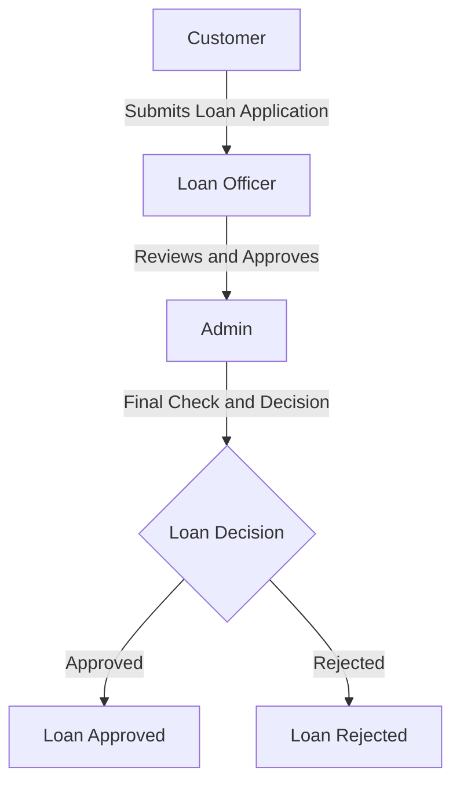

A web-based Loan Approval Management System designed to manage the loan application process through a structured three-stage workflow involving the Customer, Loan Officer, and Admin.
The system helps organize loan applications, reviews, and approvals while maintaining the information in a centralized SQL Server database.

Approval Workflow

The system follows three main stages:

